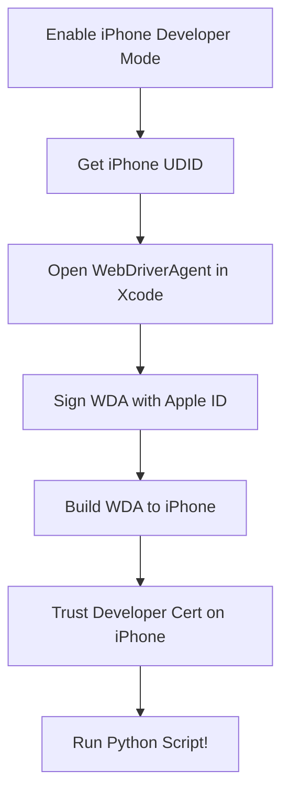

# iOS Bluetooth Automation with Appium

This project automates connecting and disconnecting a specific pair of AirPods (or other Bluetooth device) on a physical iOS device using Appium 2.x and Python.

## Prerequisites

- **Python 3.13+**
- **Node.js & npm**
- **Appium 2.x** installed globally (`npm install -g appium`)
- **Appium XCUITest Driver** installed (`appium driver install xcuitest`)
- An iOS device with Developer Mode enabled
- Xcode installed from the Mac App Store

---

## Setup Instructions

Setting up Appium on a physical iOS device requires a few strict security handshakes between your Mac and the iPhone. 



### 1. iPhone Preparation
1. Connect your iPhone to your Mac via USB cable.
2. If prompted on your iPhone, tap **Trust** and enter your passcode.
3. Enable **Developer Mode** (Required for iOS 16+):
   - Go to iPhone **Settings > Privacy & Security**.
   - Scroll to the bottom and tap **Developer Mode**.
   - Toggle it **On** and allow the device to restart.
   - After restarting, unlock the iPhone and tap **Turn On** on the prompt.

### 2. Configure Environment Variables
This project uses a `.env` file to keep your personal device IDs out of the source code.

1. Copy the example environment file:
   ```bash
   cp .env.example .env
   ```
2. Open **Finder** on your Mac.
3. Select your iPhone from the left sidebar under "Locations".
4. In the main window, click on the text directly underneath your iPhone's name (e.g., "iPhone 15 Pro"). It will cycle through your Serial Number, **UDID**, and other info.
5. Right-click the **UDID** and select **Copy**.
6. Open your `.env` file and update the variables:
   ```env
   DEVICE_UDID=YOUR_COPIED_UDID_HERE
   AIRPODS_NAME=Exact Name of AirPods in Bluetooth Menu
   WDA_BUNDLE_ID=com.facebook.WebDriverAgentRunner.yourname123
   ```

### 3. WebDriverAgent Code Signing (Mandatory Xcode Step)
Apple requires all apps installed on a physical device to be cryptographically signed. You must manually sign Appium's `WebDriverAgent` app once before the script can run.

1. **Generate Certificate:** Open **Xcode > Settings > Accounts**, sign in with your Apple ID, and generate a new "Apple Development" certificate.
2. **Open the Appium Project:** In your terminal, run this command to open the hidden WDA project in Xcode:
   ```bash
   open ~/.appium/node_modules/appium-xcuitest-driver/node_modules/appium-webdriveragent/WebDriverAgent.xcodeproj
   ```
3. **Configure Signing:** 
   - At the top of the Xcode window, select your physical iPhone as the run destination.
   - In the left sidebar, click the `WebDriverAgent` project.
   - Under **TARGETS**, select `WebDriverAgentRunner`.
   - Go to the **Signing & Capabilities** tab.
   - Check **"Automatically manage signing"** and select your Personal Team.
   - Change the **Bundle Identifier** to a unique string (e.g., `com.facebook.WebDriverAgentRunner.yourname123`).
4. **Install and Trust:** 
   - Press `Cmd + U` to build and install the app to your phone.
   - Once it installs, open your iPhone's **Settings > General > VPN & Device Management**.
   - Tap your Apple ID email under "Developer App" and tap **Trust**.
   - Finally, hit the "Stop" button in Xcode to kill the manual test.

### 4. Python Environment Setup
We use a virtual environment (`.venv`) to manage dependencies.

```bash
# 1. Create a Python 3.13 virtual environment
~/.pyenv/versions/3.13.13/bin/python -m venv .venv

# 2. Activate it
source .venv/bin/activate

# 3. Install dependencies
pip install -r requirements.txt
```

---

## Running the Automation

1. **Start the Appium Server**: Open a separate terminal window and run:
   ```bash
   appium
   ```
   Leave this window open and running.

2. **Run the Script**: In your project terminal, make sure your `.venv` is activated and run:
   ```bash
   python cycle_bluetooth.py
   ```

---

## Troubleshooting Guide

### Invalid Xcode Path Error
**Symptom:** `Could not determine Xcode version: '/Library/Developer/CommandLineTools' is not a valid Xcode path.`
**Resolution:** Run the following command to point the system to the full Xcode installation and restart the Appium server:
```bash
sudo xcode-select -s "/Applications/Xcode.app/Contents/Developer"
```

### Connection Refused (Port 8100)
**Symptom:** `Connection was refused to port 8100`
**Resolution:** This means the iPhone killed the app because you forgot to "Trust" the developer certificate in iOS Settings, OR you left the manual Xcode test running in the background. Stop the Xcode test, trust the certificate on the phone, and try again.

### NoSuchElementError (Dynamic Accessibility IDs)
**Symptom:** `NoSuchElementError: An element could not be located on the page`
**Resolution:** Ensure your `AIRPODS_NAME` variable is perfectly accurate. Remember that iOS dynamically appends connection states to Accessibility IDs. This script uses `AppiumBy.IOS_PREDICATE` to do a fast `CONTAINS` match, avoiding the strict match requirements of `ACCESSIBILITY_ID` and the slowness of XPath.
